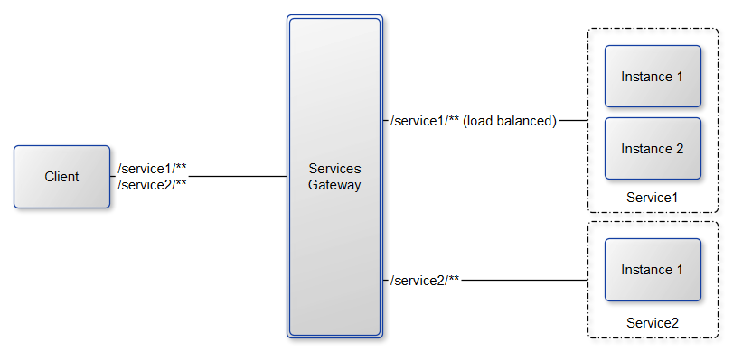

# micro-service-load-balance-and-routing

Pour tester le loadbalancing avec Consul/Zuul, il faut d'abord lancer Consul (lancer la tâche ANT qui s'en occupe). 

Ensuite, il faut lancer les différents services : 
- Hello (lancer 2 instances sur un port différent)
- Gateway
- Gateway-Client

Gateway-Client propose un endpoint "/hello". 
Son objectif est de chercher le service Gateway abonné à Consul (grâce au DiscoverClient). 
Puis, il utilise le routing de zuul pour appeler un des 2 services "Hello" abonnés (et démarrés)
 
**NB**: Quand on stoppe un des 2 services "Hello" avec IntelliJ, le désabonnement prend du temps, et le LoadBalancing peut donner l'impression de ne pas fonctionner. 
L'actuator ayant été ajouté, il est donc possible d'appeler le endpoint "/shutdown" sur le service. 
Ceci aura pour conséquence de désabonner le service de Consul.

